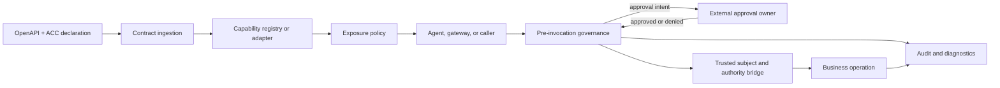
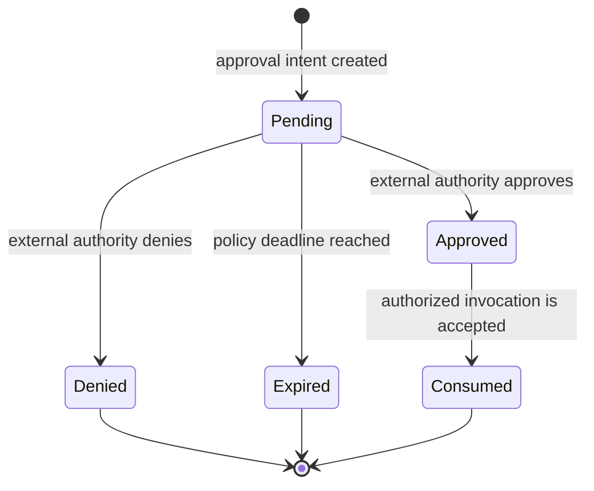

# ACC Implementer's Guide

Status: Non-normative guidance
Applies to: ACC v1

This guide helps teams turn ACC declarations into parsers, generators, gateways, policy components, or complete runtimes. It explains implementation patterns without prescribing a product architecture.

Normative ACC behavior is defined only by [SPEC.md](SPEC.md), the binding documents, and the versioned schema. If this guide conflicts with those sources, the normative sources win.

## 1. Reading Labels

This document uses four labels:

- **Normative**: behavior already required or recommended by ACC v1.
- **Recommended**: an implementation pattern that commonly produces safe, portable behavior.
- **Optional**: useful platform functionality that is not required for ACC compatibility.
- **Example**: one possible design. Examples do not define the standard.

ACC does not require a particular programming language, database, model provider, UI, deployment topology, tool transport, or approval product.

## 2. Choose an Implementation Profile

Before building, choose the claim that matches the component:

- **ACC parser**: reads and validates ACC declarations.
- **ACC generator**: produces ACC declarations from source code, annotations, or another contract.
- **ACC runtime**: applies ACC exposure and invocation semantics.
- **ACC policy component**: evaluates a documented subset of ACC governance semantics for another runtime or gateway.

The profiles and their minimum evidence are defined in [conformance/PROFILES.md](conformance/PROFILES.md). A component should claim only the profile it actually implements.

## 3. Reference Architecture

The following architecture is a reference, not a required topology:



| Module | ACC relationship | Implementation freedom |
|---|---|---|
| Contract ingestion | **Normative** for parsers and runtimes: read the declaration, validate required fields, preserve OpenAPI parameter schemas, and diagnose unsupported versions. | Parser library, build-time compiler, gateway plugin, generated code, or another form. |
| Capability registry or adapter | **Recommended**: keep the normalized operation, parameter schema, ACC metadata, and source location together. | In memory, generated artifact, database, gateway configuration, or no persistent registry. |
| Exposure policy | **Normative** for runtimes: apply `enabled`, `scope`, trusted-subject availability, and safe handling of unsupported declarations before exposing a capability. | Route policy, tenant policy, gateway policy, static allowlist, or another documented policy context. |
| Caller or selection layer | **Optional**: an LLM function-calling loop is one possible caller, not an ACC requirement. | Agent runtime, deterministic workflow, API gateway, MCP gateway, human-operated tool, or another caller. |
| Pre-invocation governance | **Normative** for runtimes: validate arguments, risk, approval intent, execution hints, and sensitive-data handling before business execution. | Inline middleware, policy engine, sidecar, gateway filter, or generated wrapper. |
| Approval owner | ACC declares approval intent but does not own the workflow. | Existing business workflow, ticketing system, human-in-the-loop service, or another authority. |
| Authority bridge | **Normative boundary**: ACC is not final authorization. The business system must decide whether the trusted acting subject may perform the operation. | Existing session/role model, service authorization API, policy engine, or another business-owned mechanism. |
| Execution transport | Outside ACC core. | HTTP, RPC, message queue, local call, MCP transport, or another mechanism. |
| Audit and diagnostics | **Normative or recommended** according to ACC fields: preserve capability, governance decision, result/failure summary, and requested redaction. | Database, event stream, logs, tracing backend, or another storage model. |

Cost tracking, console UI, routing products, model orchestration, HMAC signatures, queues, and deployment tooling may be valuable, but they are not required by ACC v1.

## 4. Declaration Ingestion Lifecycle

**Normative and recommended sequence:**

1. Parse the OpenAPI operation and locate `x-agent-capability`.
2. Validate `version`, `enabled`, and `scope`.
3. Resolve standard OpenAPI `parameters` and `requestBody` schemas.
4. Validate that every `approval.when.param` resolves to a declared, typed argument.
5. Reject or skip unsupported major versions with diagnostics.
6. Ignore unknown ACC fields safely.
7. Preserve implementation-specific extensions without treating them as security policy.
8. Produce a normalized capability record or equivalent generated artifact.

A runtime should keep the original operation identity and source location so diagnostics can point back to the contract authors.

## 5. Exposure Lifecycle

Before a capability becomes visible to an agent or caller:

1. Exclude declarations with `enabled: false` or an empty `scope`.
2. Apply the runtime's documented scope allowlist semantics.
3. If `subject.required` is true, require a trusted acting subject before exposure or invocation.
4. Apply safe risk defaults when `risk.level` is omitted.
5. Preserve the standard parameter schema used for argument generation and validation.
6. Emit diagnostics for skipped or unsupported declarations.

For approval evaluation, `approval.required: true` is unconditional. Otherwise, `approval.when` uses ANY semantics: the first or any matching condition is sufficient to create an approval intent. Implementations may evaluate every condition for diagnostics, but a non-matching condition cannot cancel another matching condition.

ACC does not standardize a route object. A runtime may use routes, products, tenants, scenarios, or static policies as its exposure context, provided its matching behavior is documented.

## 6. Invocation Lifecycle

The following sequence is suitable for an LLM tool loop, API gateway, deterministic workflow, or another caller:

```text
select capability
  -> validate arguments against OpenAPI
  -> resolve trusted acting subject
  -> evaluate scope and runtime policy
  -> evaluate risk and approval intent
  -> apply timeout/rate-limit policy
  -> request approval or continue
  -> invoke the business operation
  -> let the business system authorize the subject
  -> record result/failure with redaction
  -> return a typed result to the caller
```

The model or caller may propose a capability and arguments. It must not determine its own scope, risk, subject trust, approval decision, or audit policy.

Machine-readable reference inputs and abstract expected outcomes are published under [conformance/v1](conformance/v1/README.md). They test portable decisions rather than a particular queue, database, hash algorithm, or user interface.

### 6.1 Trust Across Multiple Hops

`subject.required: true` distinguishes a capability that needs a trusted acting subject from one that does not. It does not make an arbitrary inbound `subject` field trustworthy, and it does not establish an end-to-end delegation chain.

For a chain such as `Agent A -> Runtime B -> Runtime C -> business operation`, every trust boundary must answer separately:

- who asserted the subject;
- how that assertion was authenticated or verified;
- whether delegation to the next hop is allowed;
- what capability, arguments, task, audience, and time window the delegation covers;
- what happens when verification, freshness, or replay checks fail.

A runtime must not upgrade model output or an unverified upstream claim into trusted subject context. Deployments that need cross-hop continuity should use a complementary identity or delegation mechanism and document its binding to ACC capability identity and invocation arguments. ACC compatibility alone is not evidence that the subject at the final hop is the subject authenticated at the first hop.

## 7. Approval Intent Reference Flow

ACC declares that approval is required; it does not standardize the workflow owner or persistence model.

A portable reference state model is:



Recommended safety properties:

- freeze or hash the capability identity and invocation arguments that were reviewed;
- bind the decision to a trusted approver or business authority;
- prevent an approval from authorizing different arguments;
- make an approval single-use unless the business policy explicitly says otherwise;
- record denial, expiry, and execution failure as distinct outcomes.

After approval, a runtime may resume a suspended invocation, enqueue a new invocation, or rerun a deterministic snapshot. Those are implementation choices, not ACC semantics.

### 7.1 Traceability And Independently Verifiable Evidence

An audit trail written by the same runtime that resolves the subject and enforces approval can provide useful operational traceability inside that runtime's trust domain. It is not independent proof against compromise of that runtime.

Where a deployment requires approval evidence that another party can verify, it should bind at least the subject, capability identity, canonical invocation arguments, task or request identity, decision, issuer, and validity context before execution. The deployment must also define:

- one canonical byte representation shared by signer and verifier;
- signature and key-discovery rules;
- freshness and clock assumptions;
- nonce, sequence, or other replay protection;
- fail-closed behavior when any verification step is unavailable or ambiguous.

These details are deliberately not ACC v1 semantics. A deployment may use a separate approval-evidence or delegation protocol, provided it does not present that protocol's guarantees as guarantees of ACC itself.

## 8. Security Invariants and Failure Modes

These are specification-derived invariants, not claims about how often a particular implementation fails.

| Invariant | Failure mode | Expected protection |
|---|---|---|
| ACC controls reach; the business system controls authority. | Treating `scope` or `subject.required` as final business permission. | Re-authorize the acting subject inside the business system at call time. |
| Governance metadata is trusted contract input, not model output. | Letting generated text lower risk, invent a subject, approve itself, or disable audit. | Keep governance decisions outside the model-controlled payload. |
| Subject trust is established at a trust boundary; it does not compose by relabeling an upstream claim. | Treating an inbound subject identifier as proof of end-to-end identity or delegation. | Resolve or verify the subject at each boundary and use a complementary delegation mechanism when continuity across hops is required. |
| Approval comparisons are JSON type-aware. | Coercing `"1000"` to `1000` or `"true"` to `true`. | Validate against OpenAPI and use strict JSON equality and numeric rules. |
| Unknown fields have no implicit security meaning. | A runtime-specific extension silently bypasses scope, approval, or audit. | Ignore unknown ACC fields or process them only under an explicit non-ACC policy namespace. |
| Approval applies to a reviewed invocation. | Approval for one argument set is reused for another. | Bind the decision to capability identity and canonical arguments. |
| Runtime audit records are traceability, not automatically independent proof. | The same compromised runtime authors the approval assertion and the evidence used to verify it. | Use externally verifiable, pre-execution evidence when the threat model requires it. |
| Sensitive declarations affect observability. | Raw secrets or personal data enter logs, traces, or metric labels. | Redact or summarize before persistence and export. |
| Unsupported versions are visible. | A runtime silently interprets a newer declaration using older semantics. | Reject or skip it with diagnostics. |

Implementation-specific incidents may be contributed as clearly labeled examples. A single product's internal failure should not be generalized into normative ACC behavior without portable semantics and conformance evidence.

## 9. Conformance Mapping

| Reference module | Primary checklist sections |
|---|---|
| Contract ingestion | Parser |
| Exposure policy | Exposure, Authority Boundary |
| Pre-invocation governance | Governance, Authority Boundary |
| Approval integration | Governance, Traceability |
| Authority bridge | Authority Boundary |
| Audit and diagnostics | Traceability |

Use [conformance/PROFILES.md](conformance/PROFILES.md) to select the applicable profile and [conformance/SELF_ASSESSMENT.md](conformance/SELF_ASSESSMENT.md) to publish evidence.

## 10. Registering an Implementation

ACC uses open registration and self-assessment, not official certification.

1. Select an implementation profile.
2. Complete the self-assessment template.
3. Publish evidence and known limitations in the implementation repository.
4. Submit a pull request that adds the implementation to [IMPLEMENTATIONS.md](IMPLEMENTATIONS.md).
5. Keep the declared ACC version and evidence current.

Registry inclusion means the declaration is complete enough to list. It is not a security audit, production-readiness guarantee, commercial endorsement, or certification.
